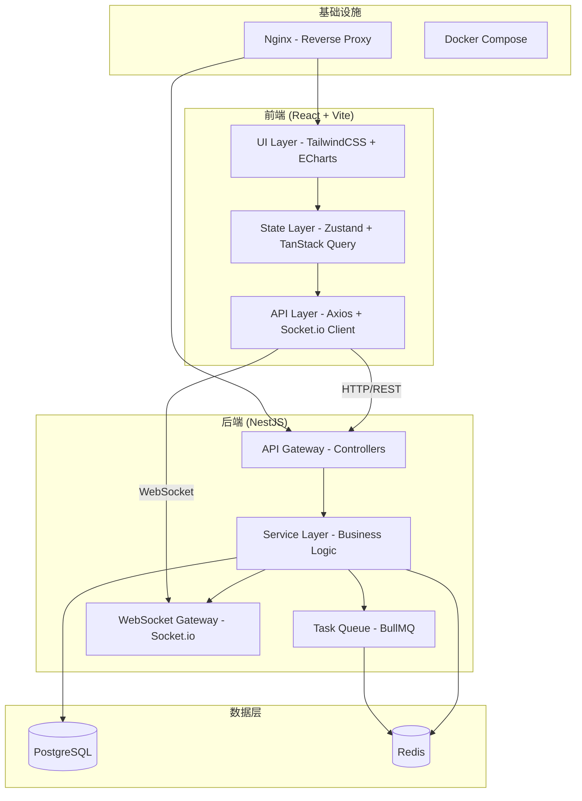
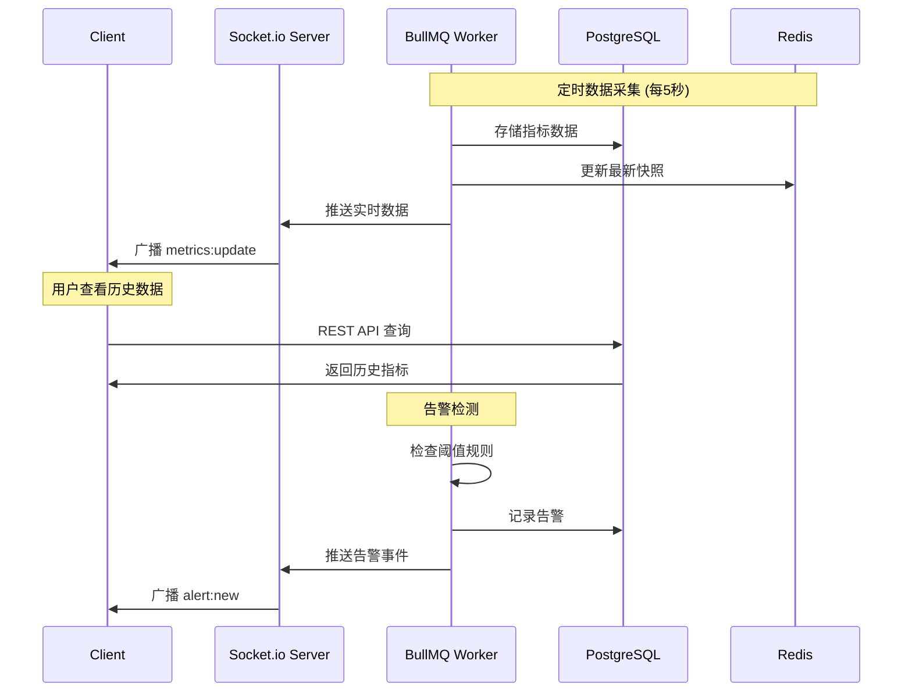
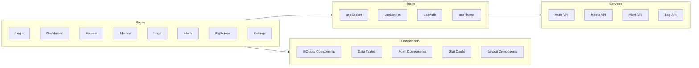
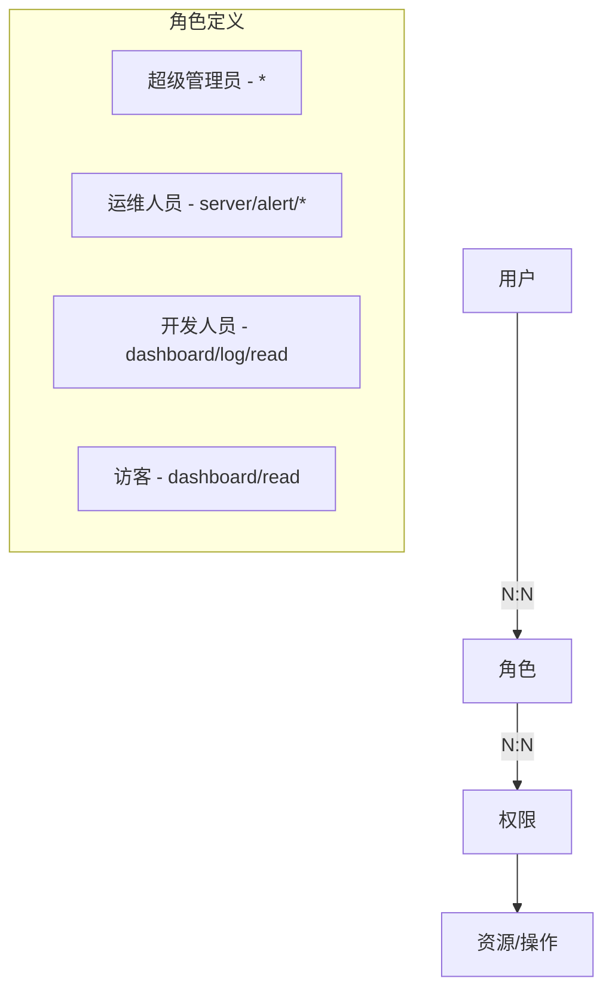

## 产品概述

构建一个企业级实时监控平台（Monitoring Dashboard），定位为类似 Grafana、阿里云监控、腾讯云监控、Zabbix、Prometheus Dashboard 的现代化运维监控系统。达到生产环境级别的商业项目基础框架水平。

## 核心功能模块

### 1. 登录认证与权限管理

- 用户登录表单（用户名/密码）
- JWT Token 认证（Access Token + Refresh Token 双令牌机制）
- RBAC 权限模型：超级管理员、运维人员、开发人员、访客
- 路由守卫与按钮级权限控制
- Token 自动刷新与过期处理

### 2. 首页总览 Dashboard

- 顶部统计卡片：在线服务器数、CPU 平均使用率、内存平均使用率、磁盘使用率、网络流量、告警数
- 支持 1s/3s/5s/10s/30s 可配置刷新频率
- 卡片类型：CPU、MEMORY、DISK、NETWORK、ALERT
- 统计卡片带趋势箭头和迷你趋势图
- 实时数据推送

### 3. 服务器监控

- 服务器列表展示：hostname、IP、操作系统、状态（online/offline）、CPU/内存/磁盘使用率
- 支持：搜索、排序、分页、标签筛选
- 服务器详情页：完整指标展示
- 状态徽标与颜色编码

### 4. 实时 CPU 监控

- 折线图时间范围：1分钟、5分钟、30分钟、24小时
- Socket.io 实时推送
- 平滑曲线、自动滚动、数据缓存、断线重连机制
- 多核 CPU 独立显示

### 5. 内存监控

- 展示：总内存、已用、空闲、缓存、Swap
- 图表类型：面积图、环形图、柱状图
- 内存泄漏趋势分析

### 6. 磁盘监控

- 展示：总容量、已使用、剩余、IOPS、读写速度
- 磁盘排行与趋势分析
- 磁盘健康状态

### 7. 网络监控

- 实时展示：上传/下载带宽、TCP/UDP 连接数
- 流量趋势图、连接数趋势图
- 网络异常检测

### 8. 日志中心

- 日志类型：系统日志、应用日志、错误日志、审计日志
- 功能：关键词搜索、时间范围筛选、日志高亮、导出（CSV/JSON）
- 类似 Kibana 的日志浏览体验
- 虚拟滚动支持大量日志

### 9. 告警中心

- 告警规则：CPU > 80%、MEMORY > 90%、DISK > 85% 等可配置阈值
- 告警等级：INFO、WARNING、ERROR、CRITICAL
- 展示：告警时间、内容、来源、处理状态
- 告警确认与静默功能
- 告警历史查询

### 10. 告警通知

- 通知渠道：邮件、Webhook、企业微信、钉钉
- 通知规则配置
- 通知模板管理
- 通知历史记录

### 11. 数据大屏（BigScreen）

- 全屏模式展示
- 内容：服务器地图分布、实时告警滚动、在线节点统计、网络流量、CPU 热力图
- 参考：阿里云数据大屏、智慧城市驾驶舱
- 自动轮播与动画效果

### 12. 系统设置

- 用户管理（CRUD）
- 角色与权限管理
- 告警规则配置
- 通知渠道配置
- 系统参数设置
- 国际化切换（中/英）

## 图表要求

- 使用 ECharts，必须包含：LineChart、BarChart、PieChart、GaugeChart、RadarChart、HeatMap、TreeMap、Funnel
- 所有图表支持响应式、暗黑模式、实时更新

## UI 设计要求

- 风格：Apple + Grafana + Linear 融合
- 关键词：高级感、科技感、工业级、极简、深色主题、磨砂玻璃、渐变发光、卡片布局
- 主色调：#0F172A、#111827、#1E293B、#3B82F6、#22C55E、#EF4444
- 支持 Light/Dark 主题切换

## 工程质量要求

- TypeScript 严格模式
- ESLint + Prettier 代码规范
- 单元测试与 E2E 测试
- Docker Compose 一键启动
- 代码分割与懒加载
- 性能优化（React.memo、useMemo、useCallback、虚拟列表）

## 技术栈

### 前端

- **框架**：React 18 + TypeScript（严格模式）
- **构建工具**：Vite 5
- **路由**：React Router v6（懒加载）
- **状态管理**：Zustand（轻量级全局状态）
- **服务端状态**：TanStack Query v5（数据缓存、自动重试、乐观更新）
- **HTTP 客户端**：Axios（拦截器统一处理 Token/错误）
- **样式**：TailwindCSS 3 + 自定义设计系统
- **图表**：ECharts 5（封装为可复用组件）
- **实时通信**：Socket.io Client（断线重连、事件总线）
- **国际化**：react-i18next
- **表格**：TanStack Table（虚拟滚动、排序、筛选、分页）
- **表单**：React Hook Form + Zod 校验
- **测试**：Vitest（单元）+ Playwright（E2E）

### 后端

- **框架**：NestJS 10（模块化架构）
- **数据库**：PostgreSQL 16（TypeORM）
- **缓存**：Redis 7（ioredis）
- **实时通信**：Socket.io（Gateway 模式）
- **任务队列**：Bul lMQ（定时采集、告警检测、通知发送）
- **认证**：Passport.js + JWT（@nestjs/jwt, @nestjs/passport）
- **校验**：class-validator + class-transformer
- **API 文档**：Swagger/OpenAPI
- **测试**：Jest（单元/集成）+ Supertest（API）

### 基础设施

- **容器化**：Docker + Docker Compose
- **反向代理**：Nginx
- **数据库迁移**：TypeORM migrations
- **进程管理**：PM2（生产环境）

## 实现方案

### 架构设计



### 数据流设计



### 前端模块架构



### RBAC 权限模型



### 后端模块架构

```
src/
├── modules/
│   ├── auth/          # 认证模块 (JWT + Passport)
│   ├── user/          # 用户管理
│   ├── role/          # 角色权限
│   ├── server/        # 服务器管理
│   ├── metric/        # 指标采集与查询
│   ├── alert/         # 告警规则与记录
│   ├── notification/  # 通知渠道
│   ├── log/           # 日志管理
│   └── ws/            # WebSocket Gateway
├── common/
│   ├── decorators/    # 自定义装饰器
│   ├── guards/        # 权限守卫
│   ├── interceptors/  # 拦截器
│   ├── filters/       # 异常过滤器
│   └── pipes/         # 校验管道
├── config/            # 配置管理
├── database/
│   ├── entities/      # TypeORM 实体
│   └── migrations/    # 数据库迁移
└── jobs/
    └── workers/       # BullMQ 工作进程
```

### 数据库设计（核心表）

| 表名 | 用途 | 核心字段 |
| --- | --- | --- |
| users | 用户 | id, username, password_hash, email, role_id, status |
| roles | 角色 | id, name, permissions (JSONB) |
| servers | 服务器 | id, hostname, ip, os, tags, status, last_heartbeat |
| metrics | 指标时序数据 | id, server_id, metric_type, value, timestamp |
| alerts | 告警记录 | id, server_id, rule_id, level, message, status, created_at |
| alert_rules | 告警规则 | id, metric_type, condition, threshold, enabled |
| notifications | 通知记录 | id, alert_id, channel, status, sent_at |
| logs | 日志 | id, server_id, level, source, message, timestamp |


### 性能优化策略

1. **前端**：

- 路由级代码分割（React.lazy + Suspense）
- 虚拟列表（大数据量日志/表格）
- ECharts 实例复用与增量更新
- TanStack Query 数据缓存与背景刷新
- Zustand 最小化重渲染（selector 精确订阅）

2. **后端**：

- Redis 缓存热点查询（最新指标快照）
- PostgreSQL 时序数据按时间分区
- BullMQ 异步任务处理（数据采集/告警检测/通知发送）
- Socket.io Room 按服务器隔离推送范围

3. **基础设施**：

- Nginx Gzip 压缩与静态资源缓存
- Docker 多阶段构建减小镜像体积
- PostgreSQL 连接池配置

## 实施方案

采用前后端分离开发，分五个阶段推进：

### 阶段一：基础设施搭建

- Vite + React + TypeScript 项目初始化
- NestJS 项目初始化与模块骨架
- Docker Compose 环境编排
- PostgreSQL Schema 设计与迁移

### 阶段二：认证与布局

- JWT 认证全流程
- RBAC 权限守卫
- 主布局（Sidebar + Header + Content）
- 主题系统与设计基础

### 阶段三：核心监控页面

- Dashboard 总览
- 服务器监控列表
- CPU/内存/磁盘/网络指标页面
- ECharts 图表组件库

### 阶段四：实时通信与告警

- Socket.io 实时数据推送
- 告警规则引擎
- 告警中心与通知系统
- 日志中心

### 阶段五：高级功能

- 数据大屏
- 系统设置
- 国际化
- 测试与优化
- 部署配置

## 设计风格

采用 Apple HIG 的简洁克制 + Grafana 的数据密度 + Linear 的流畅交互，打造工业级深色监控界面。

整体以深色（Dark）为主基调，辅以冷蓝（#3B82F6）作为品牌色和交互高亮，搭配半透明磨砂玻璃卡片，营造科技感与层次感。信息密度高但不杂乱，通过合理的间距、字重对比和颜色语义引导用户快速获取关键信息。

采用 TailwindCSS 自定义设计系统 + shadcn/ui 组件库作为基础，定制深色主题变量，确保全局一致性。

## 设计关键词

- 科技感（Tech-feel）：深色背景 + 冷色光效 + 渐变边框
- 工业级（Industrial）：高信息密度、数据优先、功能导向
- 极简（Minimal）：去除多余装饰、留白呼吸、图标语义化
- 磨砂玻璃（Glassmorphism）：卡片半透明 + backdrop-blur
- 流畅动效（Smooth）：状态过渡、数据更新微动画、hover 反馈

## 页面规划（6个核心页面）

### 1. Login 登录页

居中卡片式登录，深色渐变背景 + 微动画粒子效果。品牌 Logo + 标语居上，用户名/密码表单居中，记住密码/忘记密码辅助链接。登录按钮渐变蓝色高亮。整体简洁大气，背景微动增加科技感。

### 2. Dashboard 总览页

顶部 6 张统计卡片横排（CPU/MEM/DISK/NETWORK/ALERT/SERVERS），每张卡片含数字、趋势箭头、迷你 sparkline。中部左侧大面积实时折线图（CPU/内存趋势），右侧服务器状态分布饼图 + 告警等级雷达图。底部最近告警列表（表格形式）。Header 含刷新频率切换器和时间范围选择。

### 3. Servers 服务器列表页

顶部搜索栏 + 标签筛选条 + 视图切换（表格/卡片）。表格视图含服务器名、IP、OS、状态徽标（绿/红）、CPU/内存/磁盘进度条、操作按钮。支持列排序、分页。卡片视图以网格展示服务器卡片，每卡含关键指标和状态。

### 4. Metrics 指标详情页

左侧服务器选择侧边栏（可折叠），右侧为主内容区。顶部时间范围选择器（1m/5m/30m/24h）+ 自动刷新开关。主区域分 Tab：CPU、Memory、Disk、Network，每个 Tab 内含多图表（折线图/面积图/仪表盘/柱状图），图表支持缩放、数据点 hover tooltip、全屏查看。

### 5. Alerts 告警中心页

顶部告警统计概览（按等级分色卡片：INFO蓝/WARNING黄/ERROR红/CRITICAL紫红）。中部告警规则列表（可 CRUD），含规则名、条件表达式、阈值、状态开关。下部告警历史表格，含时间、等级、来源、内容、状态（待处理/已确认/已静默）、操作按钮。

### 6. BigScreen 数据大屏页

全屏无边框布局。顶部中央大标题"运维监控中心" + 实时时钟。左列：服务器分布地图（ECharts Map）+ 服务器状态统计。中列：CPU/内存实时大折线图 + 网络流量双轴图。右列：实时告警滚动列表 + 告警等级分布饼图 + 关键指标仪表盘。底部：事件时间线滚动。整体深色背景，信息以卡片/面板排列，数据实时刷新带动画过渡。

## Agent Extensions

### SubAgent

- **code-explorer**
- **用途**：在项目构建过程中，当需要搜索已有文件结构、定位修改目标、跨多个文件查找模式时调用
- **预期效果**：快速准确地定位代码位置，确保修改完整性

### Skill

- **skill-creator**
- **用途**：在项目开发过程中，如果需要创建可复用的开发脚手架技能或自动化工作流，使用此技能来构建自定义 Skill
- **预期效果**：产出标准化的项目构建技能，便于后续复用